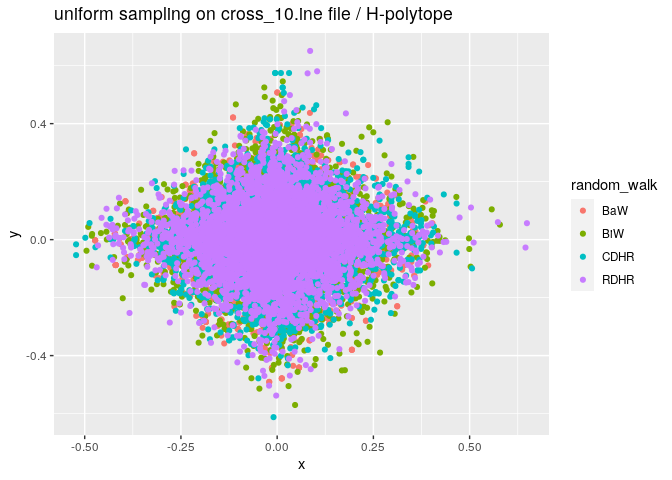

## Compile and run VolEsti. Use the R extension to visualize sampling in a polytope.

Here are the libraries needed


```r
options(tinytex.verbose = TRUE)
library(ggplot2)
library(volesti)
```

```
## Loading required package: Rcpp
```


### keep a polytope as a variable after reading a .ine file 


```r
options(tinytex.verbose = TRUE)
polytope = file_to_polytope("/home/haris/volume_approximation/R-proj/inst/extdata/cross_10.ine")
```


### random sampling with different algorithms 


```r
options(tinytex.verbose = TRUE)
points_cdhr =  sample_points(P = polytope, n = 5000, distribution = list("density" = "uniform"),  random_walk = list("walk"="CDHR"))
points_rdhr =  sample_points(P = polytope, n = 5000, distribution = list("density" = "uniform"),  random_walk = list("walk"="RDHR"))
points_biw =  sample_points(P = polytope, n = 5000, distribution = list("density" = "uniform"),  random_walk = list("walk"="BiW"))
points_baw =  sample_points(P = polytope, n = 5000, distribution = list("density" = "uniform"),  random_walk = list("walk"="BaW"))
```


### keep sample points 


```r
options(tinytex.verbose = TRUE)
BaW = data.frame(x=points_baw[1,], y=points_baw[2,])
BiW = data.frame(x=points_biw[1,], y=points_biw[2,])
CDHR = data.frame(x=points_cdhr[1,], y=points_cdhr[2,])
RDHR = data.frame(x=points_rdhr[1,], y=points_rdhr[2,])
```


### bind all the points in a dataframe

```r
options(tinytex.verbose = TRUE)
walks = rbind(BaW,BiW,CDHR,RDHR)
```


### add a column in the dataframe to tag the points of each algorithm

```r
walks$random_walk = c(rep("BaW",5000),rep("BiW",5000),rep("CDHR",5000),rep("RDHR",5000)) 
```


### plot it 

```r
ggplot(walks, aes(x=x, y=y, group=random_walk,col=random_walk)) + 
  geom_point() + geom_smooth() + labs(title = "uniform sampling on cross_10.ine file / H-polytope")
```

```
## `geom_smooth()` using method = 'gam' and formula 'y ~ s(x, bs = "cs")'
```

<!-- -->

