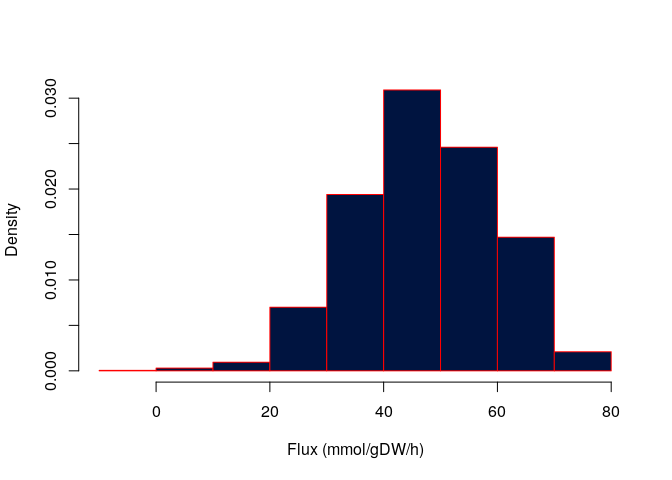
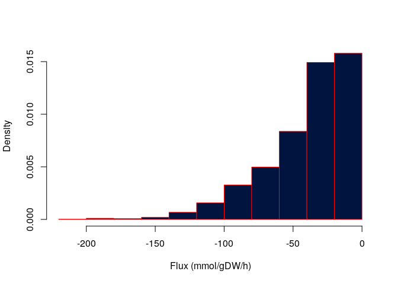
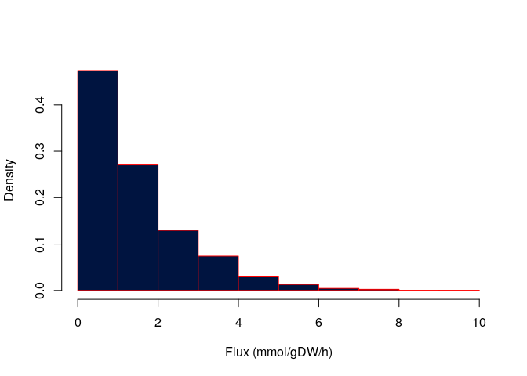

## Support lower dimensional polytopes in volesti and use existing methods to sample from them

### COBRA Toolbox and MATLAB

The following code was performed on MATLAB (see on [COBRA Toolbox tutorial](https://opencobra.github.io/cobratoolbox/latest/tutorials/tutorialUniformSampling.html)) in oder to get a fully dimensional polytope, sample on it and then plot the values of a certain reaction (coordinate 12). 


```matlab_core
load('e_coli_core.mat')
model = e_coli_core;
ATP = 'ATPS4r'; 
ibm = find(ismember(model.rxns, ATP)); % column index of the ATP demand reaction
model.c = zeros(length(model.c),1);
model.csense=model.csense';
[samples, roundedPolytope, minFlux, maxFlux] = chrrSampler(model, 100, 2000,1);
ibm=12
nbins = 20;
[yUn, xUn] = hist(samples(ibm, : ), nbins);
f2 = figure;
plot(xUn, yUn);
xlabel('Flux (mmol/gDW/h)')
ylabel('# samples')
```

Here is the plot returned:
<div class="figure">

<p class="caption">Plot from MATLAB</p>
</div>


### Volesti and R 


Simultaneously, we performed the similar task using volesti R package in order to compare the output returned.

Here are the libraries needed

```r
library(ggplot2)
library(R.matlab)
```

```
## R.matlab v3.6.2 (2018-09-26) successfully loaded. See ?R.matlab for help.
```

```
## 
## Attaching package: 'R.matlab'
```

```
## The following objects are masked from 'package:base':
## 
##     getOption, isOpen
```

```r
library(volesti)
```

```
## Loading required package: Rcpp
```

#### Get the rounded polytope file (.mat) and read it 

```r
rounded_polytope_file = "/home/haris/Desktop/gsoc2020/gsoc2020/roundedPolytope.mat"
rounded_polytope = readMat(rounded_polytope_file)
rounded_polytope = rounded_polytope$poly
```

#### We keep all the variables needed in order to move from the rounded polytope back to the initial.

```r
A_init = rounded_polytope[1]
A_init = A_init[[1]]
A = A_init[[1]]

b_init = rounded_polytope[2]
b_init = b_init[[1]]
b = b_init[[1]]

G_init = rounded_polytope[5]
G_init = G_init[[1]]
G = G_init[[1]]

shift_init = rounded_polytope[6]
shift_init = shift_init[[1]]
shift = shift_init[[1]]
```

And now we have A and b defining our full dimensional polytope (this transformations occured in the Matlab step), G for getting fron n-m dimensions back to n (low dimensional polytope) and 'shift' a variable that allows us to move our polytope. 

#### Sample from our rounded, low dimension polytope

```r
N = 2000
full_dim_polytope = Hpolytope$new(A=A, b=b)
points = sample_points(full_dim_polytope, n=N, random_walk = list("walk" = "BiW", "walk_length" = 2))
dim(points)
```

```
## [1]   24 2000
```


#### Map our sampling points back to the full dimension polytope

```r
steady_states = G%*%points + matrix(rep(shift,N), ncol = N)
dim(steady_states)
```

```
## [1]   95 2000
```


### Comparison 

#### And this is the corresponding plot for our comparison with COBRA Toolbox (coordinate 12)


```r
hist(steady_states[12,], # my sampling points when returned in the low dimensional polytope
     col="#001440", # column color
     border="red",
     prob = TRUE, # show densities instead of frequencies
     xlab = "Flux (mmol/gDW/h)",
     main = "")
```

<!-- -->

#### And here is an example of how the different reactions of our metabolic network differ at the steady states
<!-- -->


<!-- -->


